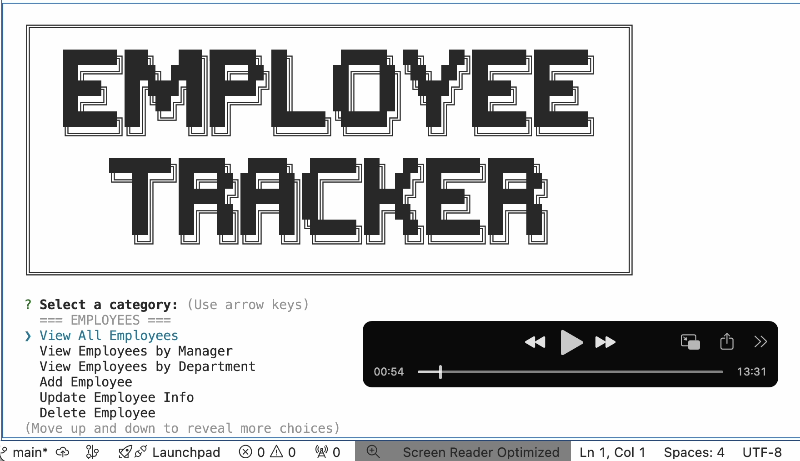

# Employee Tracker


## Table of Contents
- [Description](#description)
- [Features](#features)
    - [Departments](#departments)
    - [Roles](#roles)
    - [Employees](#employees)
- [Getting Started](#getting-started)
    - [Prerequisites](#prerequisites)
    - [Installation](#installation)
- [Usage](#usage)
- [Technologies Used](#technologies-used)
- [Walkthrough Video](#walkthrough-video)
- [Contributing](#contributing)
- [Skills and Knowledge Developed](#skills-and-knowledge-developed)
- [Credits](#credits)
- [License](#license)

## Description
Employee Tracker is a command-line content-management system (CMS) designed to efficiently manage employee databases. Built with Node.js, Inquirer, and PostgreSQL, this application offers a user-friendly interface for executing various CRUD operations across departments, roles, and employees.

Features include:
- Viewing, adding, updating, and deleting departments, roles, and employees.
- Sorting and organizing data efficiently.
- Ensuring data security with environment variables.

[Back to Table of Contents](#table-of-contents)

## Features

### Departments
- **View All Departments**: Displays a formatted table of all departments, including IDs and names.
- **Add Department**: Prompts user input for a new department name to add to the database.
- **Update Department Info**: Allows updating the name of an existing department.
- **Delete Department**: Enables removal of a department from the database.
- **Sort Data**: Offers sorting options by ID and department name.

[Back to Table of Contents](#table-of-contents)

### Roles
- **View All Roles**: Shows a formatted table of all roles, including IDs, titles, salaries, and associated departments.
- **Add Role**: Prompts for new role details like title, salary, and department to be added.
- **Update Role Info**: Allows updating information for an existing role.
- **Delete Role**: Enables removal of a role from the database.
- **Sort Data**: Offers sorting options by various fields such as ID, title, and salary.

[Back to Table of Contents](#table-of-contents)

### Employees
- **View All Employees**: Displays a table of employee details, including IDs, names, titles, departments, salaries, and managers.
- **View Employees by Manager/Department**: Filters employees by their manager or department.
- **Add Employee**: Prompts for details of a new employee to add to the database.
- **Update Employee Info**: Allows updates to existing employee details.
- **Delete Employee**: Enables removal of an employee from the database.
- **Sort Data**: Offers sorting options by fields like ID and name.

[Back to Table of Contents](#table-of-contents)

## Getting Started

### Prerequisites
- Node.js
- PostgreSQL
- Inquirer 8.2.4

[Back to Table of Contents](#table-of-contents)

### Installation
1. **Clone the repository**:
   ```bash
   git clone https://github.com/ngojohn2002/12-SQL-Employee-Tracker
   cd 12-SQL-Employee-Tracker
   ```

2. **Install dependencies**:
   ```bash
   npm install
   ```

3. **Set up environment variables**:
   Create a `.env` file in the root with the following content:
   ```
   DB_DATABASE=employee_tracker
   DB_USER=your_username
   DB_PASSWORD=your_password
   DB_HOST=localhost
   DB_PORT=5432
   ```

4. **Initialize the database**:
   ```bash
   psql -U your_username -d postgres -f sql/initialize_db.sql
   ```

5. **Seed the database**:
   ```bash
   psql -U your_username -d employee_tracker -f sql/seeds.sql
   ```

[Back to Table of Contents](#table-of-contents)

### Usage
To start the application:
   ```bash
   npm start
   ```
Follow the prompts to manage the database.

[Back to Table of Contents](#table-of-contents)

## Technologies Used
- Node.js
- Inquirer.js
- PostgreSQL
- dotenv

[Back to Table of Contents](#table-of-contents)

## Walkthrough Video
Click the thumbnail below to view the demonstration video:
[](https://drive.google.com/file/d/14FgQPnM8RTP9erH7Py7_1WxlblKgtG02/view?usp=sharing)

[Back to Table of Contents](#table-of-contents)

## Contributing
1. **Fork the repository**.
2. **Create a new branch**:
   ```bash
   git checkout -b feature/your-feature-name
   ```
3. **Commit your changes**:
   ```bash
   git commit -m 'Add some feature'
   ```
4. **Push to the branch**:
   ```bash
   git push origin feature/your-feature-name
   ```
5. **Open a pull request**.

[Back to Table of Contents](#table-of-contents)

## Skills and Knowledge Developed
- **Backend Development**: Implemented a relational database schema using PostgreSQL.
- **Node.js**: Developed a CLI using Node.js.
- **Asynchronous Programming**: Applied async/await for database operations.
- **User Interaction and CLI Tools**: Utilized Inquirer.js for user input.
- **Environment Configuration**: Managed sensitive settings with dotenv.
- **Project Management and Version Control**: Used Git for version control.
- **Problem-Solving and Debugging**: Focused on error handling and data validation.
- **Documentation**: Created comprehensive documentation for the project.

[Back to Table of Contents](#table-of-contents)

## Credits

This project was made possible with the help of [ChatGPT](https://chatgpt.com/).

[Back to Table of Contents](#table-of-contents)

## License

This project is licensed under the [MIT License](LICENSE).

[Back to Table of Contents](#table-of-contents)

---

Copyright &copy; 2024 - All Rights Reserved.
